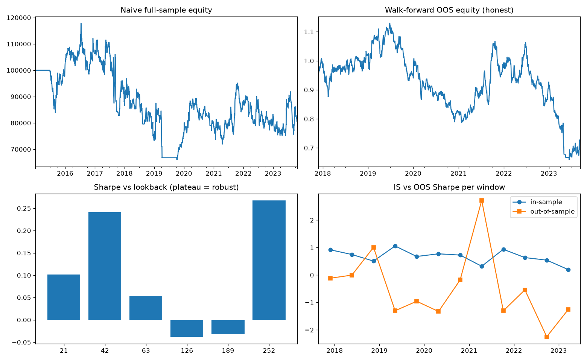

# QuantBT — a backtester that tries to prove itself wrong

Most backtesting projects answer one question: *did this strategy make money
in the past?* This one answers the question that actually matters:

> **Is the observed performance distinguishable from luck, given how many
> things I tried?**

It supports US equities, futures, and crypto (daily bars via `yfinance`,
CSV, or a built-in synthetic generator), and centers on a statistical
validation pipeline built around the **Deflated Sharpe Ratio** (Bailey &
López de Prado, 2014), **walk-forward optimization**, and **block-bootstrap
confidence intervals**.



## Why this isn't another moving-average-crossover repo

| Common backtester mistake | How quantbt handles it |
|---|---|
| Lookahead bias (signals trade on the same bar they're computed) | One-day execution lag enforced *inside the engine*, in exactly one place — and a unit test (`test_no_lookahead`) proves a same-day "oracle" strategy earns nothing |
| Zero or flat transaction costs | Costs scale with turnover (commission + slippage in bps per side), so high-frequency "edges" pay for their trading |
| Reporting the best in-sample result of many trials | Walk-forward OOS returns are the only quoted performance, and the Deflated Sharpe Ratio raises the significance bar to the *expected maximum Sharpe of N noise strategies* |
| Point estimates with no uncertainty | Stationary block bootstrap gives 5th–95th percentile bands for Sharpe and max drawdown, preserving volatility clustering |
| Fragile parameters | Sensitivity scan: a robust edge is a plateau across neighboring parameters, not a single spike |
| No way to test the tester | Synthetic regime-switching random walks as a null control (the pipeline must find *nothing*) and trending series as a positive control (momentum must work) — both enforced in the test suite |

## Quickstart

```bash
git clone https://github.com/rickymong/QuantBT.git
cd QuantBT
pip install -r requirements.txt

# offline demo on synthetic data
python examples/full_workflow.py

# real data: SPY (equity), ES=F (futures), BTC-USD (crypto)
pip install yfinance
python examples/full_workflow.py --live

# run the test suite
python -m pytest tests/ -v
```

## The workflow

```python
from quantbt import (Backtest, CostModel, Momentum, load_yfinance,
                     walk_forward, deflated_sharpe_ratio, block_bootstrap)

prices = load_yfinance(["SPY", "ES=F", "BTC-USD"], start="2016-01-01").dropna()
costs = CostModel(commission_bps=1, slippage_bps=4)

# 1. Walk-forward: pick params on 3y of data, trade the next 6m, roll forward
wf = walk_forward(prices, Momentum,
                  {"lookback": [21, 63, 126, 252], "long_only": [True, False]},
                  train_days=756, test_days=126, cost_model=costs)
print("Out-of-sample Sharpe:", wf["oos_sharpe"])

# 2. Was that luck? DSR knows how many parameter combos were tried.
print(deflated_sharpe_ratio(wf["oos_returns"], n_trials=wf["n_trials"],
                            all_trial_sharpes=wf["all_trial_sharpes"]))

# 3. How bad could it plausibly get?
print(block_bootstrap(wf["oos_returns"]).loc[["5%", "50%", "95%"]])
```

Writing a strategy is one class:

```python
from quantbt import Strategy

class MyStrategy(Strategy):
    def __init__(self, lookback=63):
        super().__init__(lookback=lookback)      # params dict = tunable knobs

    def compute_weights(self, prices):
        # row t may use data up to and including t —
        # the ENGINE applies the execution lag, not you.
        return prices.pct_change(self.params["lookback"]).clip(-1, 1)
```

## Interpreting the Deflated Sharpe Ratio

The DSR is the probability that the true Sharpe of your *best* strategy
exceeds the Sharpe you'd expect the luckiest of your N attempts to show by
chance. It corrects for sample length, skewness, fat tails, **and the number
of trials**. Convention: require DSR ≥ 0.95.

Concretely, in the demo run: after a 6×2 parameter grid across 12
walk-forward windows (144 trials), the "luck benchmark" is an annualized
Sharpe of ~1.0. A strategy that can't beat *that* hasn't demonstrated
anything — which most simple strategies on daily bars can't, and the tool
says so honestly. **A validation pipeline that never says FAIL is broken.**

## Known limitations (stated, not hidden)

- **Daily close-to-close fills.** No intraday execution, limit orders, or
  market-impact modeling; slippage is a flat bps assumption.
- **Yahoo continuous futures are not roll-adjusted** — returns across roll
  dates include roll gaps. For serious futures work, build a back-adjusted
  series from individual contracts.
- **No survivorship-bias-free equity universe.** Backtesting on today's
  index members overstates performance; use point-in-time constituents for
  cross-sectional equity strategies.
- **Crypto trades 7 days/week; equities don't.** The demo intersects
  calendars, which discards weekend crypto moves. Annualization constants
  assume 252 days.
- Portfolio margin, borrow costs for shorts, and financing are not modeled.

Each of these is a natural extension — see below.

## Roadmap / extension ideas

- [ ] Purged & embargoed k-fold cross-validation (López de Prado ch. 7)
- [ ] Probability of Backtest Overfitting (PBO) via combinatorially symmetric cross-validation
- [ ] Back-adjusted futures roll logic
- [ ] Volume-dependent market impact model (square-root law)
- [ ] Live paper-trading bridge (Alpaca / Binance testnet)

## References

- Bailey, D. & López de Prado, M. (2014). *The Deflated Sharpe Ratio:
  Correcting for Selection Bias, Backtest Overfitting and Non-Normality.*
- Bailey, Borwein, López de Prado & Zhu (2014). *Pseudo-Mathematics and
  Financial Charlatanism.*
- López de Prado, M. (2018). *Advances in Financial Machine Learning.* Wiley.
- Politis, D. & Romano, J. (1994). *The Stationary Bootstrap.*

## Disclaimer

Educational project. Nothing here is investment advice, and backtested
performance — even statistically validated — does not guarantee future
results.
